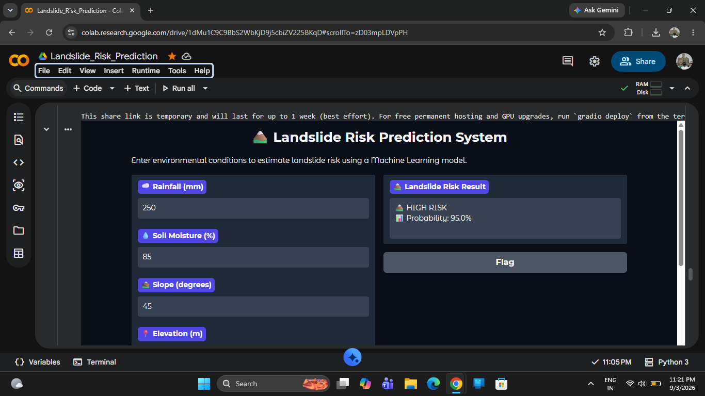

# 🏔️ Landslide Risk Prediction Using Machine Learning

A machine learning based prototype for estimating landslide risk using environmental factors.

## 📌 Project Overview

This project uses a Random Forest Classifier to predict landslide risk based on environmental conditions.

## 🌱 Input Features

The model uses:

- 🌧️ Rainfall
- 💧 Soil Moisture
- ⛰️ Slope
- 📍 Elevation
- 🌡️ Temperature
- 🌊 Distance from River
- 🌱 Vegetation Index

## 🤖 Machine Learning Model

A Random Forest Classifier is used to classify landslide risk into:

- Low Risk
- Medium Risk
- High Risk

## 🛠️ Technologies Used

- Python
- NumPy
- Pandas
- Scikit-learn
- Matplotlib
- Seaborn
- Gradio
- Google Colab

## 📊 Model Evaluation

The model was evaluated using:

- Accuracy
- Classification Report
- Confusion Matrix
- Feature Importance

## 🖥️ User Interface

A Gradio interface was developed where users can enter environmental conditions and receive a predicted landslide risk.

## ⚠️ Note

This project is a prototype developed using a synthetically generated dataset for educational and demonstration purposes. It is not a scientifically validated real-world landslide prediction system.

## 🚀 Future Scope

- Use real-world landslide datasets
- Integrate satellite imagery
- Add GIS-based visualization
- Use real-time rainfall data
- Deploy as a web application
- ## 🖥️ User Interface

A Gradio interface was developed where users can enter environmental conditions and receive a predicted landslide risk.
### Application Demo

